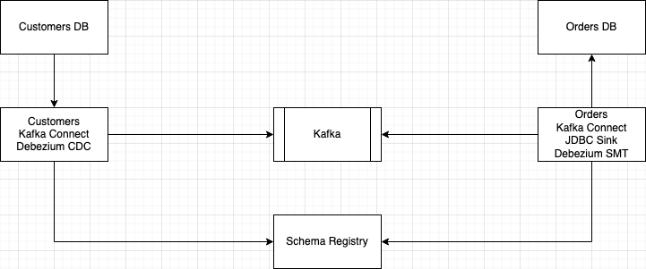

### Start:

```shell script
docker-compose up
```

## Source:

Check contents of the SOURCE database:

```
❯ docker-compose exec customers-db bash -c 'psql -U postgres customers -c "select * from customers"'
 id | name | age
----+------+-----
  1 | fred |  34
  2 | sue  |  25
  3 | bill |  51
(3 rows)
```

Source connector has one transformation: `transforms=route`. It is a RegexRouter which just changes
the name of the topic.

### DB operations:

Insert:

```shell script
docker-compose exec customers-db psql -U postgres customers -c "INSERT INTO customers (name, age) VALUES ('New Customer', 35);"
```

Update:

```shell script
docker-compose exec customers-db psql -U postgres customers -c "UPDATE customers SET name='Not fred' WHERE id = 1;"
```

Delete:

```shell script
docker-compose exec customers-db psql -U postgres customers -c "DELETE FROM customers WHERE id = 2;"
```

## Sink:

Check contents of the SINK database:

```
❯ docker-compose exec orders-db bash -c 'psql -U postgres orders -c "select * from customers_replica"'
 id | name | age
----+------+-----
  1 | fred |  34
  2 | sue  |  25
  3 | bill |  51
(3 rows)
```

## Notes:

- DB sync behaviour can be achieved without schema-registry by using `org.apache.kafka.connect.json.JsonConverter` in key and value converter